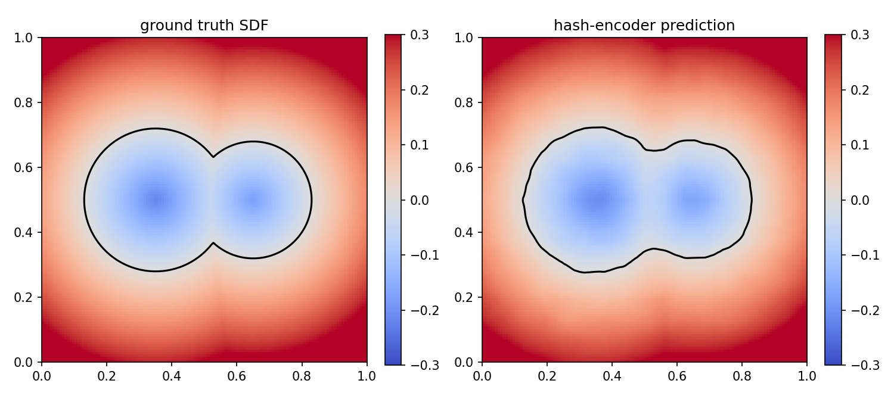

# MLX / Metal GPU Programming

Two small projects exploring custom Metal kernel authoring in MLX on Apple Silicon.

## [01 — Fused projection kernel](01_projection_kernel/)
A first custom Metal kernel: fusing a multi-surface nearest-point projection
into a single GPU dispatch. Forward-only, used to learn the basic
`mx.fast.metal_kernel` API.

## [02 — Differentiable multiresolution hash-grid encoder](02_hash_encoder/)
A more advanced project: a simplified reimplementation of the kind of custom
CUDA hash-grid encoder used in neural implicit surface research (the role
`hashencoder.cu` plays in my S2MDF work), with a hand-derived backward pass,
trained end-to-end inside a small coordinate MLP and benchmarked against a
fixed Fourier-feature baseline.
## Results

    hash_encoder: train_time=1.87s  test_mse=0.000007
    fourier_baseline: train_time=0.79s  test_mse=0.000057
